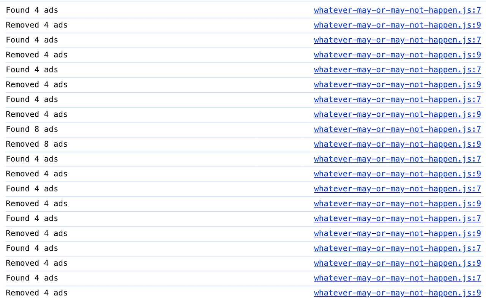
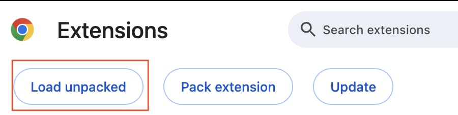
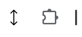

# Whatever may or may not work



## Installation

Clone this project

```shell 
git clone https://github.com/revuedepresse/whatever-may-or-may-not-work
```

or download a copy from [GitHub](https://github.com/revuedepresse/whatever-may-or-may-not-work/archive/refs/heads/main.zip) before 
  - unzipping the archive file, and
  - clicking on "Load unpacked" in the Chrome extensions page (`chrome://extensions/`)
    with "Developer mode" enabled.



The following icon should be available from the browser extension menu   
even though pinning it would have no practical effect:  


## License

GNU General Public License v3.0 or later

See [COPYING](./COPYING) to see the full text.
